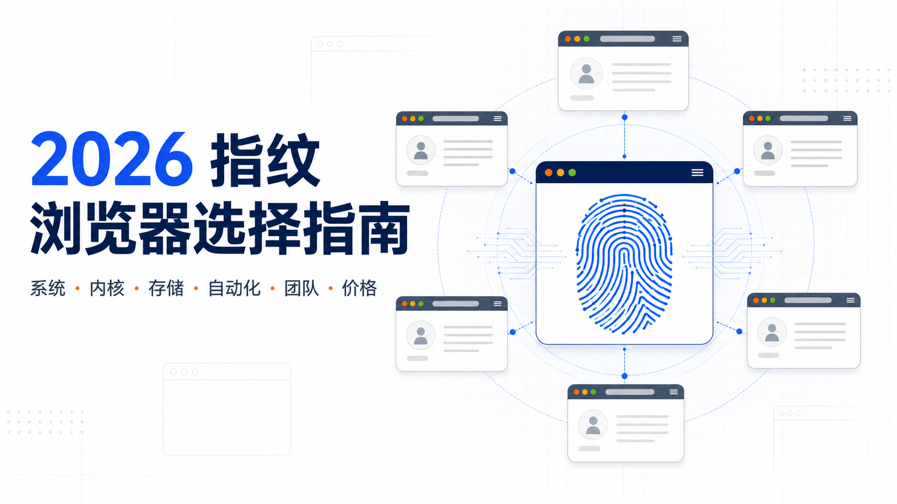
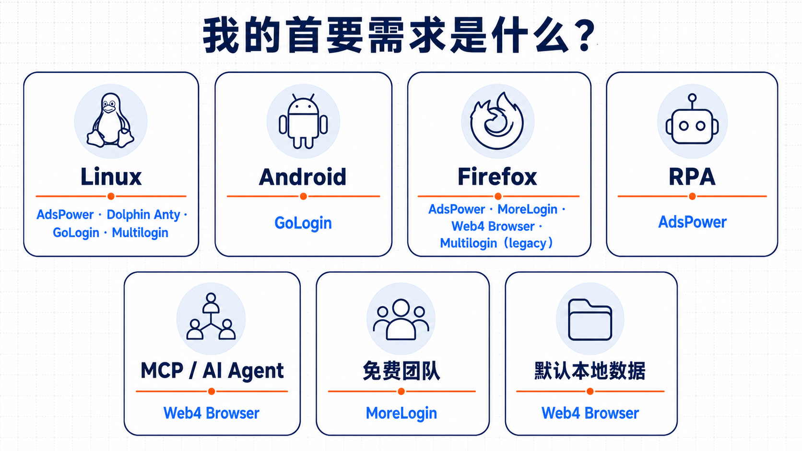
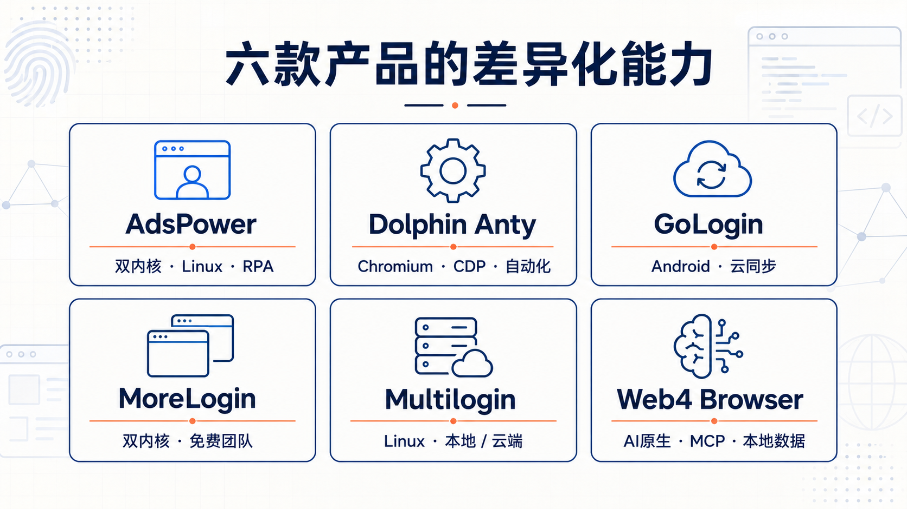
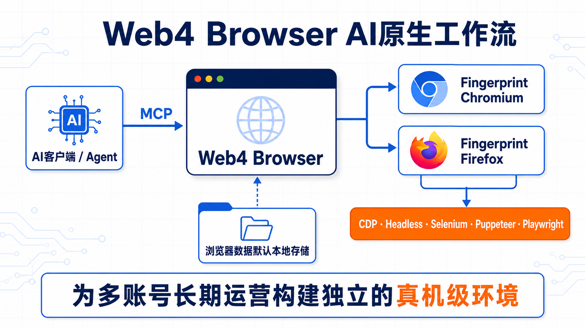

# 2026 指纹浏览器怎么选？6 款主流产品功能、价格与适用场景对比

指纹浏览器没有适合所有人的统一“第一名”。个人用户可能更关注免费环境和操作难度，团队需要考虑成员权限与环境交接，开发者关心 API 和自动化框架，长期运营者还要确认数据保存方式、浏览器内核更新和真实总成本。

本文对比 AdsPower、Dolphin Anty、GoLogin、MoreLogin、Multilogin 和 Web4 Browser。与只给出综合排名的文章不同，这里先按使用条件筛选产品，再解释六款产品分别适合什么需求、有哪些公开限制。

*图 1：2026 指纹浏览器选择指南。本文从系统、内核、存储、自动化、团队和价格六个维度比较产品。*

> 本文最后核查日期为 **2026-07-17**。功能、价格和系统要求来自厂商公开页面，完整来源保存在 [`SOURCES.md`](SOURCES.md)。本文尚未进行统一条件下的横向实测，因此不比较账号存活率、风控通过率或指纹检测分数。

## 一分钟选择建议

如果你不想先读完整篇，可以从下面的需求开始缩小范围：

| 你的主要需求 | 可以先核对的产品 | 选择理由 |
|---|---|---|
| 需要 Linux 客户端 | AdsPower、Dolphin Anty、GoLogin、Multilogin | 四者的官方公开资料列出 Linux 支持，但发行版和最低版本不同 |
| 需要 Android 原生客户端 | GoLogin | 本次六款产品中，GoLogin 的官方支持列表明确包含 Android 10+ |
| 需要 Chromium 与 Firefox 两类环境 | AdsPower、MoreLogin、Web4 Browser；谨慎核对 Multilogin | Multilogin 的 Stealthfox 已被官方标为 legacy |
| 需要内置 RPA | AdsPower | 公开资料同时列出 Local API 和内置 RPA |
| 需要 MCP 或 AI Agent 工作流 | Web4 Browser | 本次核查范围内，唯一在公开功能页明确列出 MCP 的产品 |
| 想用免费版测试团队流程 | MoreLogin | 免费档公开包含 2 个环境和 2 个成员 |
| 需要本地与云端存储选择 | AdsPower、Dolphin Anty、MoreLogin、Multilogin | 四者公开了本地与云同步或云端相关选项，具体实现不同 |
| 更关注浏览器数据默认本地保存 | Web4 Browser | 公开功能页说明浏览器数据默认存储在本地 |

*图 2：按首要需求建立候选名单。Multilogin 的 Firefox 系环境 Stealthfox 已被官方标记为 legacy。数据核查日期：2026-07-17。*

这里的“可以先核对”不是最终推荐。它只表示产品满足某项公开的硬条件，下一步仍要结合环境数量、成员数、代理、自动化和预算确认。

## 六款指纹浏览器核心对比

以下按产品英文名排序，不代表名次。

| 产品 | 更值得关注的定位 | 免费档 | 代表性付费入口 | 购买前需要注意 |
|---|---|---:|---:|---|
| [AdsPower](https://www.adspower.com/) | 双内核、Linux、Local API 与 RPA | 2 个环境 | Professional 从 10 个环境起 | 公开价格使用动态选择器，本次未获得稳定静态金额 |
| [Dolphin Anty](https://dolphin-anty.com/) | Chromium 环境、多种自动化接口 | 5 个环境 | 20 个环境，10 美元/月 | Firefox 相关页面表述存在冲突 |
| [GoLogin](https://gologin.com/) | Android 客户端、云同步、Orbita 内核 | 3 个环境 | 9 美元/月起 | 免费版不含 API 和团队；年付月均价存在页面冲突 |
| [MoreLogin](https://www.morelogin.com/) | 双内核、免费团队成员、本地缓存与云同步 | 2 个环境、2 个成员 | 10 个环境，9 美元/30 天 | 模拟移动参数不等于提供手机客户端 |
| [Multilogin](https://multilogin.com/) | Linux、本地或云端环境、主流自动化框架 | 5 个环境 | Pro 10，85 美元/年 | Stealthfox 为 legacy；免费环境有闲置删除条件 |
| [Web4 Browser](https://web4browser.io/cn/) | AI原生、双内核、MCP、本地数据 | 3 个环境 | 15 个环境，9 美元/月 | Linux、Android 和免费团队成员未在当前公开资料中列出 |

*图 3：六款产品最值得优先核对的差异化能力。图片用于快速理解，完整限制和来源仍以正文及数据文件为准。*

完整字段、官方来源和核查备注见[产品事实 CSV](data/products.csv)与[价格记录 CSV](data/pricing.csv)。

## AdsPower：双内核、Linux 与 RPA 组合

AdsPower 的公开资料列出 Windows、macOS 和 Ubuntu 客户端，浏览器环境包括基于 Chromium 的 SunBrowser 与基于 Firefox 的 FlowerBrowser。自动化方面同时提供 Local API 和内置 RPA，并公开了成员角色、权限及环境分享功能。

它更适合先被以下用户核对：需要 Linux 客户端；需要 Chromium 与 Firefox 两类环境；希望同时使用代码接口和低代码 RPA；团队需要按成员分配环境与权限。

免费档包含 2 个环境和 1 个超级管理员，但普通成员为 0。其价格页能够选择 Professional、Business 和不同环境档位，不过金额由动态选择器生成，本次核查没有获得可稳定引用的静态起价，因此本文没有采用第三方排行榜中的价格补数。

**选择判断：** AdsPower 的公开能力覆盖面较广，尤其是双内核、Linux 和 RPA 的组合；如果主要需求只是少量环境，也要确认这些功能是否值得对应的套餐成本。

## Dolphin Anty：Chromium 环境与多种代码自动化入口

Dolphin Anty 支持 Windows、macOS 和 Linux。官方设置文档将 Anty 描述为基于 Chromium 的浏览器，并公开列出 API、CDP、Selenium、Puppeteer 和 Playwright，同时提供代理管理、环境分享、转移和可选云同步。

免费档公开包含 5 个环境和 1 个用户；Starter 的代表性入口为 20 个环境、10 美元/月。对于想先测试 Chromium 多环境流程、需要 Linux，或者已经使用主流浏览器自动化框架的用户，它具有比较清晰的候选价值。

需要注意的是，Dolphin Anty 设置文档明确写基于 Chromium，但价格页抓取文本同时出现“Chrome or Firefox engine”。在厂商进一步澄清前，本文不把 Firefox 作为已经确认的能力。

**选择判断：** 它的公开差异主要在 Chromium、多自动化框架和相对较高的免费环境数，而不是已确认的双内核支持。

## GoLogin：Android 客户端与云同步路线

GoLogin 的官方支持列表包括 Windows、macOS、Ubuntu、Mint 和 Android 10+，浏览器使用基于 Chromium 的 Orbita。它公开提供 REST API 以及 Selenium、Puppeteer、Playwright 接入资料，环境数据以云同步为主，运行时会产生本地临时数据。

在这六款产品里，GoLogin 最明确的差异是 Android 原生客户端。如果你的工作流程需要直接从 Android 设备启动和管理环境，而不是只在桌面端模拟移动参数，它值得优先核对。

免费档包含 3 个环境，但不包含 API、团队成员、环境分享和云端运行。Professional 公开为 9 美元/月起；同一帮助页中的年付月均价出现 4.5 美元与 9 美元两种表述，因此结算前需要再次确认。

**选择判断：** Android 和跨设备云同步是 GoLogin 更鲜明的选型理由；只看“3 个免费环境”会忽略免费版的重要功能限制。

## MoreLogin：双内核与免费团队流程

MoreLogin 的公开资料列出 Windows 和 macOS 客户端，浏览器环境包括 Chrome 与 Firefox，并提供 Local API、Selenium、Puppeteer、团队角色和环境授权。浏览器数据采用本地缓存，也可以使用云同步相关功能。

它的免费档包含 2 个环境和 2 个成员，这一点适合希望先验证两人团队协作、环境授权和基本操作流程的用户。代表性付费入口为 10 个环境、9 美元/30 天，另有 60、180 和 360 天计费矩阵。

MoreLogin 环境可以模拟 Windows、macOS、Android 和 iOS 参数，但这不表示客户端可以安装在 Android 或 iOS 上。当前公开的客户端系统仍是 Windows 与 macOS。

**选择判断：** MoreLogin 的公开差异在双内核、免费成员和团队角色；有移动端需求时，应先分清“移动参数模拟”和“原生手机客户端”。

## Multilogin：本地或云端环境与成熟自动化接口

Multilogin 支持 Windows、macOS 和 Ubuntu，提供 Mimic（Chromium 系）和 Stealthfox（Firefox 系）环境。自动化资料覆盖 API、Selenium、Puppeteer 和 Playwright，环境可以选择本地或云端存储，但移动环境仅支持云端。

免费档公开包含 5 个环境；Pro 10 的公开价格为 85 美元/年。对于需要 Linux、主流自动化框架，或者希望在本地和云端环境之间选择的用户，它具有明确的候选价值。

但“支持 Firefox 系环境”需要附带重要条件：官方帮助页已将 Stealthfox 标为 legacy，并说明它不再获得内核更新。此外，免费环境连续 7 天未启动任何环境时，可能触发自动删除条件。

**选择判断：** Multilogin 公开的系统、存储和自动化路线比较完整；选择前最需要确认的是 Stealthfox 的维护状态以及免费环境保留规则。

## Web4 Browser：面向长期多账号运营的 AI原生指纹浏览器

Web4 Browser 对外使用的产品定位是：

> **Web4 Browser——AI原生指纹浏览器，为多账号长期运营构建独立的真机级环境。**

*图 4：Web4 Browser 公开功能中的 AI 与浏览器自动化工作流示意。“真机级环境”为产品定位，本图不代表指纹检测、账号通过率或长期存活率测试结果。*

它支持 Windows 10/11 x64 和 macOS 12+，提供 Fingerprint Chromium 与 Fingerprint Firefox。公开自动化入口包括 MCP、CDP、Headless、Selenium、Puppeteer 和 Playwright，浏览器数据默认存储在本地。

在本次六款产品的公开资料中，Web4 Browser 是唯一明确列出 MCP 的平台。这个差异使它不只面向传统脚本自动化，也尝试让支持 MCP 的 AI 客户端或 Agent 调用浏览器环境。MCP、Headless、CDP 和主流自动化框架的组合，是“AI原生”定位目前最具体的产品支撑。

免费档包含 3 个环境；Starter 为 15 个环境、9 美元/月。当前公开下载资料没有列出 Linux 或 Android 客户端，免费档也不包含团队成员，因此这三项需求需要提前排除或确认。

“真机级环境”是 Web4 Browser 的产品定位，不是本文已经通过统一检测得出的实测结论。本文可以确认的是其双内核、MCP、自动化入口和默认本地数据口径，不能据此承诺账号通过率或长期存活率。

**选择判断：** 如果核心需求是本地数据、双内核，以及 MCP 与浏览器自动化组合，Web4 Browser 的差异化最清晰；如果必须使用 Linux、Android 或免费团队成员，则需要考虑其他候选产品。

## 购买前最容易忽略的 5 个问题

### 1. 模拟移动设备不等于提供移动客户端

环境能够呈现 Android 或 iOS 参数，只说明网站可能看到对应的设备信号。软件能否安装在手机上，是另一项客户端系统能力。本次六款产品中，GoLogin 的公开支持列表明确包含 Android 10+。

### 2. “支持 Firefox”不代表路线仍在持续更新

对双内核有要求时，应继续核对内核名称、当前版本和维护状态。Multilogin 的 Stealthfox 就是一个典型例子：产品仍列出该环境，但官方已将其标为 legacy。

### 3. 免费环境数不等于免费功能完整度

API、成员、分享、同步、自动化和环境保留期限可能分别受限。免费版更适合做兼容性和流程检查，不能直接代表付费套餐体验。

### 4. 本地数据与云同步各有代价

本地数据通常更便于控制数据驻留，云同步通常更方便跨设备和团队协作。选择时还要核对加密、备份、权限、删除、迁移和数据恢复，而不能直接把“本地”等同于安全第一名。

### 5. 广告起价不能代表你的真实成本

应使用实际环境数、成员数、额外席位、计费周期和必要功能计算总价。AdsPower 的动态价格、GoLogin 的年付价格冲突，以及不同平台对管理员和成员的定义，都说明只比较首页起价容易得出错误结论。

## 最后应该怎么选

可以按下面四步完成第一轮筛选：

1. **用系统和内核排除产品。** 先确认 Linux、Android、Chromium 或 Firefox 是不是硬条件。
2. **用工作方式缩小范围。** 再看本地或云端存储、团队权限、RPA、API、MCP和自动化框架。
3. **计算真实套餐成本。** 把环境数、成员数、额外成员费和计费周期放在一起比较。
4. **验证自己的实际流程。** 使用免费版或试用版检查系统兼容性、代理配置、环境启动、团队交接和自动化脚本；不要把一次成功外推成长期保证。

如果只记住一个原则，那就是：**先按不可妥协的条件筛选，再比较价格；不要先看一个没有公开权重和测试证据的综合排名。**

## 本文能回答与不能回答的问题

本文可以回答：六款产品的官方公开系统、内核、免费额度、代表性价格、自动化入口、团队和存储口径，以及公开页面中的冲突和限制。

本文不能回答：哪个平台的账号存活率最高、指纹检测分数最好、大规模并发最稳定，或者客服和退款执行最好。这些结论需要统一环境、版本、代理、目标网站、样本量和原始日志。

## 数据、来源与更新

为了让表格中的结论能够被复查，本项目保留了机器可读数据和来源账本：

- [产品事实 CSV](data/products.csv)：系统、内核、自动化、团队、代理、存储和免费额度；
- [价格记录 CSV](data/pricing.csv)：计费周期、环境数、成员数、币种、来源和核查日期；
- [六个平台详细对比](docs/comparison.md)：更完整的字段解释和选型分析；
- [来源账本](SOURCES.md)：每项结论对应的官方页面；
- [评估方法](METHODOLOGY.md)：证据等级、价格标准化和冲突处理；
- [免责声明](DISCLAIMER.md)：时效性、厂商表述和合法使用边界。

首版没有统一条件下的真实横向测试，因此数据中没有 `tested` 记录。发现价格变化、失效链接或事实错误时，欢迎提交带有官方 URL 和访问日期的 issue。

本文面向合法的隐私保护、网站兼容性测试、广告验证、授权账号管理、跨境业务和浏览器自动化，不提供欺诈、撞库、身份验证规避、账号交易或其他滥用指导。
